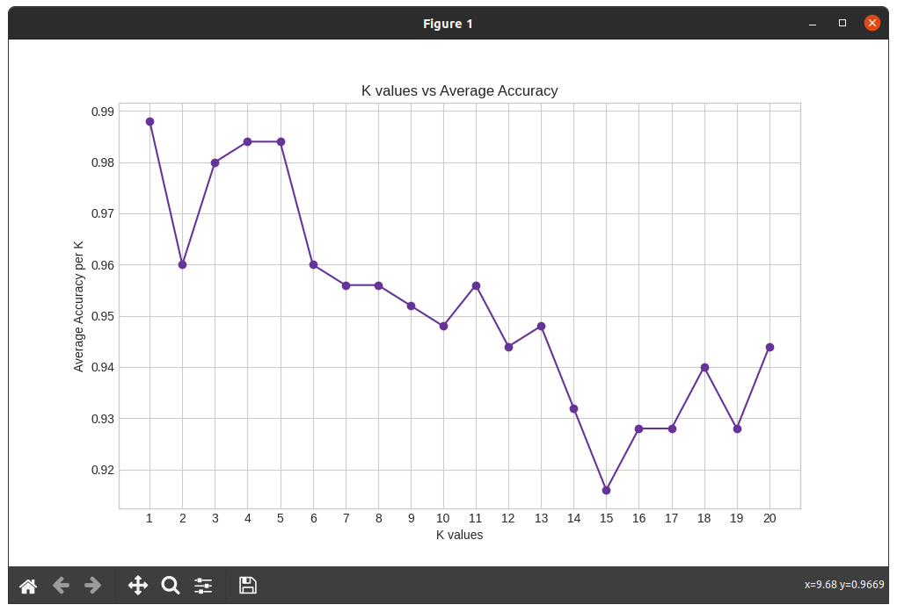

# Homework 1: Group Homework [iris_KNN]
## Team Members:
Jesus Jimenez-Sanchez <br> 
**Email:** Jimenezsanchezj18@students.ecu.edu

## Quick Start:
Before running the program, make sure that the "iris.data" file is installed in the same directory.<br>
Additionally, make sure that all libraries needed are installed from "requirements.txt". It includes these libraries:
```
scipy
numpy
pandas
matplotlib
seaborn
scikit-learn
pillow
yellowbrick
ipywidgets
keras
tensorflow
```

If you are on a linux device, use pip and use this command in the terminal to install them all:

```console
pip3 install -r requirements.txt
```
### Run the program:
First, make sure that the **iris_KNN.py** and **iris.data** is downloaded in the same folder/directory.
Using either terminal or an IDE run the program: <br>
If you are using an IDE, make sure that the files are in the same directory and run the **.py** file. <br>
If you are using a terminal to run the program, you will need to cd into the directory first where the **.py** file is contained.

For example:
**Terminal:**
```console
foo@bar:~$ cd Desktop/CSCI_4120-master/KNN/.
foo@bar:~$ python3 'iris_KNN.py'
...
```
You will then be shown accuracies per k and a linechart showing the values visually similar to this:


### Which K works best?
According to the data shown, k=5 has the best accuracy. I have also noticed that when running the programming, usually k<5 are the highest, specifically k=3.
My assumption with it being so accurate is that when using sklearn's library, the splitting of the data is more conistant. <br>
KNeighborsClassifier may implement scaling if needed. While the original code assumed everything was on the same scale. 
Overall, if the accuracies are similar across k's it may be due to the way the data is split and sorted when training and testing the AI. Due to the use of random_state it allows for reproducability.
```python
return train_test_split(x, y, test_size=1-split, random_state=42)
```
Another reason why the data may be similar may be due to the data being provided as it is relativly simple. Additionally, if the data is balanced, it can lead to similar performance across the k values.
