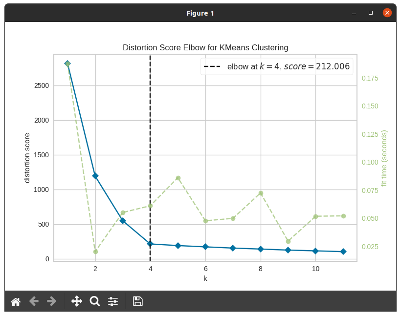
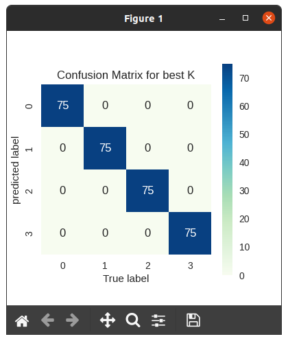

# Homework 2: HW_ELBOW_KMEANS
## Team Members:
Jesus Jimenez-Sanchez <br> 
**Email:** Jimenezsanchezj18@students.ecu.edu

## Quick Start:
Before running the program, make sure that all libraries needed are installed from "requirements.txt". It includes these libraries:
```
scipy
numpy
pandas
matplotlib
seaborn
scikit-learn
pillow
yellowbrick
ipywidgets
keras
tensorflow
```
The file is in the main repository **CSCI4120/** under this one. <br>
If you are on a linux device, use pip and use this command in the terminal to install them all:

```console
pip3 install -r requirements.txt
```
### Run the program:
If you are using an IDE, make sure that the files are in the same directory and run the **.py** file. <br>
If you are using a terminal to run the program, you will need to cd into the directory first where the **.py** file is contained.

For example in a linux terminal it would look like this:
```console
foo@bar:~$ cd Desktop/CSCI_4120-master/hw2/.
foo@bar:~$ python3 'hw2.py'
...
```
You will then be shown a initial graph from the KElbowVisualizer. It will show the best K. Once you close that tab out, it will then show you a confusion matrix for the best K.

### Which K is the best?

K = 4 is the best based on the elbow shown in the graph, having an 100% accuracy. <br>
This is the confusion matrix that should be outputted:

